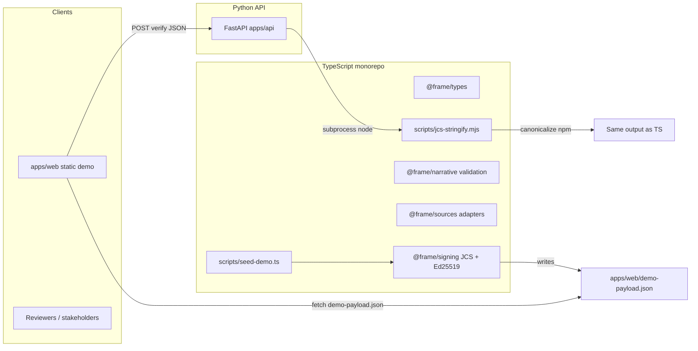

# Frame — full handoff report (architecture, code, deploy, public demo)

**Purpose:** Give any collaborator or LLM (e.g. Claude) enough context to run, extend, and **deploy** Frame — especially on **Render** and for a **public demo URL**.

**Companion:** Shorter living context in [`CONTEXT.md`](./CONTEXT.md) (rules, quick map).

---

## 1. What Frame is (product)

Frame turns **political claims** into **cryptographically signed receipts**:

- **Claims** + **sources** (FEC, OpenSecrets, lobbying, etc.) + **narrative** (short sentences).
- Each narrative sentence **must** cite a `sourceId` that exists in `sources`.
- **Ed25519** signs the receipt; **JCS (RFC 8785)** canonicalizes JSON before hashing — **never** `JSON.stringify` for crypto.
- Language rules: **neutral** copy only (no judgment adjectives). See governance in `packages/narrative/governance.ts` and `.github/copilot-instructions.md`.

---

## 2. High-level architecture



**Data flow (end-to-end):**

1. **Author** builds a `FrameReceiptPayload` (claims, sources, narrative with `sourceId`s).
2. **`@frame/narrative`** can validate banned words + domain whitelist (tests use this).
3. **`@frame/signing`** computes `contentHash` = SHA-256(JCS(body **excluding** `contentHash`, `signature`, `publicKey`)), then signs SHA-256(JCS(body **excluding** only `signature`, **including** `contentHash` + `publicKey`)) with Ed25519.
4. **Result:** `FrameSignedReceipt` JSON (includes `signature`, `publicKey` base64 SPKI DER).
5. **`apps/api`** verifies the same hashes/signatures by calling **Node** + `jcs-stringify.mjs` (must match TS `canonicalize` output byte-for-byte).
6. **`apps/web`** loads `demo-payload.json` and calls `POST /v1/verify-receipt` against a configurable API base URL.

---

## 3. Repository layout (what lives where)

| Path | Stack | Role |
|------|--------|------|
| `package.json` | Node | Root workspace; `npm test`, `npm run build`, `generate-keys` |
| `packages/types` | TS | All shared interfaces (`FrameReceiptPayload`, `SourceRecord`, …) |
| `packages/signing` | TS | `canonicalize` + `crypto` Ed25519; source of truth for signing |
| `packages/narrative/governance.ts` | TS | Banned words, `DOMAIN_WHITELIST`, `validateNarrative` |
| `packages/entity` | TS | Disambiguation helper + confidence floor |
| `packages/sources` | TS | Adapter stubs: FEC, OpenSecrets, ProPublica, lobbying, EDGAR, `manual` |
| `packages/signing/__tests__/` | TS | Vitest; Manchin fixture + signing/governance tests |
| `apps/api/main.py` | Python | FastAPI: health, verify, JCS debug |
| `apps/api/requirements.txt` | Python | fastapi, uvicorn, pydantic, cryptography |
| `apps/api/Procfile` | Render/Heroku-style | `web: uvicorn main:app --host 0.0.0.0 --port $PORT` |
| `apps/web/index.html` | Static | Demo UI; `fetch('demo-payload.json')` |
| `apps/web/demo-payload.json` | JSON | **Checked-in** example signed receipt (regenerate after key rotation) |
| `scripts/seed-demo.ts` | TS | Reads `apps/api/.env`, signs Manchin fixture → `demo-payload.json` |
| `scripts/jcs-stringify.mjs` | Node | stdin JSON → stdout JCS string (used by Python) |
| `scripts/generate-keys.ts` | TS | Prints Ed25519 PEM keypair |
| `render.yaml` | Render | Blueprint for `frame-api` (see §7) |
| `docs/CONTEXT.md` | Doc | Rules + short status |
| `docs/HANDOFF.md` | Doc | This file |

---

## 4. Cryptography & hashing (must stay consistent)

### 4.1 JCS

- **RFC 8785** JSON Canonicalization Scheme.
- **TypeScript:** `canonicalize` npm (see `packages/signing/index.ts`; CJS loaded via `createRequire`).
- **Python:** **does not** reimplement JCS — it runs `node scripts/jcs-stringify.mjs` with `cwd` = monorepo root.

### 4.2 `contentHash`

- Preimage = receipt dict **minus** keys: `contentHash`, `signature`, `publicKey`.
- `contentHash` = hex(SHA-256(UTF-8(JCS(preimage)))).

### 4.3 Signature

- Signing preimage = receipt dict **minus** only `signature` (includes `contentHash` and `publicKey`).
- Message digest = SHA-256(UTF-8(JCS(signing preimage))).
- **Ed25519** sign/verify that digest (Node `crypto.sign` / `crypto.verify` with `null` algorithm; Python `Ed25519PublicKey.verify`).

### 4.4 Keys on the wire

- Receipt field `publicKey`: **base64** of **SPKI DER** (not PEM).
- Local `.env` uses **PEM** for `FRAME_PRIVATE_KEY` / `FRAME_PUBLIC_KEY` (see `seed-demo.ts` parser).

---

## 5. HTTP API (`apps/api/main.py`)

**CORS:** `allow_origins=["*"]` so browser demo can hit a deployed API.

| Method | Path | Purpose |
|--------|------|--------|
| `GET` | `/` | Liveness + pointer to `/health` |
| `GET` | `/health`, `/health/` | Liveness |
| `GET` | `/v1/adapters` | Lists adapter kind names |
| `POST` | `/v1/jcs-sha256` | Debug: SHA-256 hex of JCS(input) |
| `POST` | `/v1/verify-receipt` | Body = full signed receipt JSON → `{ ok, reasons }` |

**Important:** `_repo_root()` uses `FRAME_REPO_ROOT` env override, else `Path(__file__).resolve().parents[2]` (monorepo root containing `scripts/jcs-stringify.mjs`).

---

## 6. Local development (commands)

```bash
# Install JS deps (repo root)
npm install
npm test          # Vitest, 5 tests
npm run build     # tsc project references

# Keys (do not commit)
npm run generate-keys
# Paste PEMs into apps/api/.env as FRAME_PRIVATE_KEY / FRAME_PUBLIC_KEY (see seed-demo)

# Sign demo payload
npx tsx scripts/seed-demo.ts

# API (PEP 668: use venv on macOS)
cd apps/api
python3 -m venv .venv && source .venv/bin/activate
pip install -r requirements.txt
uvicorn main:app --reload --port 8000
```

**Web demo:** serve `apps/web` over HTTP (not `file://`) so `fetch('demo-payload.json”)` works, e.g.:

```bash
cd apps/web && python3 -m http.server 8080
```

Open `http://127.0.0.1:8080/?api=http://127.0.0.1:8000`.

---

## 7. Render deployment (critical notes)

### 7.1 Current `render.yaml` (summary)

- **Service:** `frame-api`, **runtime:** `python`, **rootDir:** `apps/api`
- **build:** `pip install -r requirements.txt`
- **start:** `uvicorn main:app --host 0.0.0.0 --port $PORT`
- **Secrets (dashboard):** `FRAME_PRIVATE_KEY`, `FRAME_PUBLIC_KEY` (`sync: false`)

**Note:** Those env vars match **local signing** for ops; **verify** only needs the **`publicKey` inside each receipt**. You can omit private key on the server if you never sign server-side.

### 7.2 Node + `canonicalize` on Render (**likely gap**)

Verification calls **`node scripts/jcs-stringify.mjs`**, which requires:

1. **`node`** on PATH
2. **`node_modules/canonicalize`** installed at **repo root** (or resolvable from `cwd`)

A **Python-only** build in `apps/api` often **does not** install Node deps. If `/v1/verify-receipt` or `/v1/jcs-sha256` fails with JCS subprocess errors:

**Option A — extend `buildCommand`** (conceptual; adjust for Render shell):

```bash
cd ../.. && npm ci && cd apps/api && pip install -r requirements.txt
```

(or install Node via `nixpacks` / env if Render supports it for hybrid services.)

**Option B — set `FRAME_REPO_ROOT`** in Render to the deployed copy of the full repo root and ensure `node` + `npm ci` ran there.

**Option C — long-term:** pure-Python JCS that **byte-matches** `canonicalize` (hard) or a small **WebAssembly** / **Rust** helper — only pursue if you must drop Node.

### 7.3 Health checks

After deploy, hit:

- `https://<your-service>.onrender.com/`
- `https://<your-service>.onrender.com/health`

404 usually means wrong service URL, stale deploy, or app not listening on `$PORT`.

### 7.4 Static site (public demo)

Render can host **`apps/web`** as a **static site** (second service) or any static host (Cloudflare Pages, GitHub Pages, Netlify):

- Deploy `apps/web` contents; ensure **`demo-payload.json`** is included.
- Point the demo at the **live API** via query: `?api=https://<frame-api>.onrender.com` (or bake default into `index.html`).

---

## 8. Security & secrets

| Asset | Rule |
|-------|------|
| `FRAME_PRIVATE_KEY` | **Never** commit; rotate if leaked (chat, screenshot). |
| `FRAME_PUBLIC_KEY` | Sensitive only insofar as it pairs with private; fine in receipts. |
| `apps/api/.env` | Gitignored via `.env` pattern. |
| `demo-payload.json` | Public artifact; contains **publicKey** + **signature**, not private key. |

After key rotation: re-run `npx tsx scripts/seed-demo.ts` and redeploy/commit updated `demo-payload.json` if the public demo should verify.

---

## 9. Testing & CI expectations

- **Vitest:** `packages/signing/__tests__/manchin.test.ts` — JCS stability vs key order, governance clean fixture, sign+verify round-trip, tamper detection.
- **No automated Python tests** in repo yet; verify manually with `curl` against `/v1/verify-receipt` using `demo-payload.json`.

---

## 10. Quick troubleshooting

| Symptom | Likely cause |
|---------|----------------|
| `/health` 404 | Wrong Render service URL, or deploy not updated |
| Verify always fails / JCS error on API | **Node** missing or **`canonicalize`** not installed at repo root |
| Web textarea empty / old JSON | Opened `index.html` as `file://` — use `http.server` |
| `seed-demo` SPKI mismatch | `FRAME_PUBLIC_KEY` doesn’t match `FRAME_PRIVATE_KEY` |
| TS `canonicalize` import errors | ESM/CJS interop — signing uses `createRequire` |

---

## 11. Suggested next commits / tasks

1. **Render:** Fix **build** so Node + `npm ci` runs for `jcs-stringify.mjs` (if not already).
2. **Static deploy** for `apps/web` with default API URL set to production.
3. **Optional:** GitHub Action: `npm test` on PR.
4. **Optional:** Python tests for `/v1/verify-receipt` with golden vectors from TS.

---

*Update this document when deployment topology or crypto pipeline changes.*
