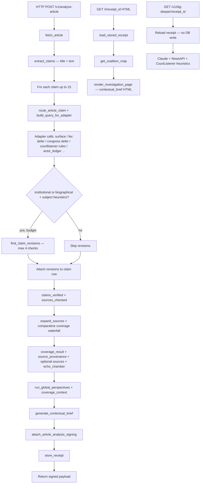

# PUBLIC EYE — Master architecture (FRAME monorepo)

**Repository identity:** The GitHub repo and docs often say “FRAME”; the **product surface** shipped as **PUBLIC EYE**. Same codebase, same API, same receipts. This document uses **PUBLIC EYE** for the user-facing article pipeline and **FRAME** where it matches historical internal naming (receipt types, env vars, routes).

---

## 1. What this is

**PUBLIC EYE / FRAME** is **epistemic infrastructure**: it turns **URLs**, **claims**, **public records**, and **LLM-assisted analysis** into **structured artifacts** that are **cryptographically signed** (where keys are configured) so downstream systems cannot silently strip caveats, gaps, or model-generated sections that are included in the **signing payload**.

It is **not** primarily a verdict engine (“true/false”). It is a **record machine**: what sources support, what they do not, what is inferred, friction between framings, and where to look next—**with a tamper-evident seal over the defined semantic slice**.

---

## 2. What this is not (sharp boundaries)

1. **Not a single-purpose demo.** The repo ships **multiple products** (see §4). Treating it as “only the article analyzer” misses FEC/SEC/deep receipts, Rabbit Hole, dossiers, jobs, and lens pipelines.

2. **Not “everything in JSON is evidence.”** Only the **JCS-canonical signing body** for each receipt type is what the signature attests to. **UI-only fields**, **IDs**, **echo scores not copied into the slice**, and **on-demand endpoints that do not mutate the stored receipt** are **not** proven by Ed25519 unless explicitly listed in §7.2.

3. **Not guaranteed always-on on the smallest Render tier.** Cold starts, timeouts, and partial receipts are **operational reality**; the pipeline is designed to return **partial but honest** outputs (e.g. missing comparative coverage) rather than fake completeness.

---

## 3. The four products sharing this codebase

| Product | User-facing idea | Primary entry |
|--------|-------------------|---------------|
| **PUBLIC EYE** | Paste a **news URL** → investigation page: coverage, framing split, volatility, signed `article_analysis` receipt | `POST /v1/analyze-article`, `GET /i/{receipt_id}` |
| **FRAME (records)** | **FEC / SEC / legal / deep** receipts from entities and queries; three-layer **deep receipt** with explicit inference layer | `POST /v1/generate-receipt`, `POST /v1/deep-receipt`, adapters in `apps/api/adapters/` |
| **Rabbit Hole** | **Narrative** genealogy (rumor, legend, myth): surface → spread → origin → actor → pattern | `POST /v1/surface` … `POST /v1/report`, TS adapters in `packages/adapters` |
| **Dossier / enrichment** | Long-running **entity dossiers** (`DossierSchema`), enrichment paths by entity type, worker-backed jobs | `apps/api/dossier/`, `worker.py` + Redis |

All four share: **FastAPI** orchestration, **Postgres** storage for receipts where applicable, **Anthropic** for many LLM steps, and **Ed25519 + JCS** for signing paths.

---

## 4. Monorepo map

```
FRAME/   (PUBLIC EYE repo)
├── apps/api/                 # FastAPI — main.py (routes + orchestration), adapters, investigation HTML
├── apps/web/                 # React/Vite — verifier and other UI surfaces
├── apps/macos/, apps/extension/
├── packages/
│   ├── signing/              # TS — Ed25519 helpers
│   ├── sources/              # FEC, narratives (TS)
│   ├── adapters/             # Rabbit Hole rings (TS)
│   ├── types/, entity/, narrative/, pattern-lib/, actor-ledger/, dispute-log/
├── scripts/                  # jcs-stringify.mjs, utilities
├── docs/                     # CONTEXT.md, HANDOFF, this file, etc.
├── render.yaml               # Render: frame-api web + cron + worker
└── README.md                 # PUBLIC EYE product story
```

**Deploy (typical):** `render.yaml` — build installs Node + Python + native deps; start `cd apps/api && uvicorn main:app`. **Worker:** `python worker.py` (ARQ + Redis). **Cron:** hits drift endpoint with shared secret.

---

## 5. Signing — exact algorithm and the rule every engineer must internalize

### 5.1 Algorithm (article analysis)

Implementation: `apps/api/report_api.py` → `build_article_analysis_signing_body` + `attach_article_analysis_signing`; canonicalization: `apps/api/jcs_canonicalize.py` (`jcs_dumps`, RFC 8785); signing: `apps/api/frame_crypto.py` → `sign_frame_digest_hex`.

1. Build **`signing_body`** — a **subset** of the full receipt (see §7.2).
2. **`canonical = jcs_dumps(signing_body)`** — deterministic JSON string.
3. **`content_hash = SHA-256(canonical)`** (hex).
4. **`signature = Ed25519_sign(private_key, content_hash.encode("utf-8"))`** — stored as base64 (see `sign_frame_digest_hex` for the exact wire format used with the hex string).
5. Response includes **`content_hash`**, **`signature`**, **`public_key`**, **`signed: true`** (when keys load).

Other receipt types (five-ring report, deep receipt, etc.) use their own **`build_*_signing_body`** equivalents — same **JCS → SHA-256 → sign** pattern, different semantic slices.

### 5.2 The rule

**If a field is not in the signing body for that receipt type, it is decoration or context for the UI—not cryptographic evidence.**

Examples for **`article_analysis`**:

- **Inside the hash (when present on the payload and copied into the slice):** `article`, `article_topic`, `claims_verified` (including **`revisions`** nested on claims when stored there), `coverage_result`, `source_provenance`, `global_perspectives`, **`contextual_brief`**, coalition-related keys **only if** they appear on the top-level receipt object **and** are listed in `build_article_analysis_signing_body` (e.g. `volatility_score`, `anchor_positions`, `what_nobody_is_covering`, `sources`, `schema_version`).
- **Often present on the stored object but not part of the article signing slice unless added to the builder:** e.g. **`echo_chamber`** is **not** included in `build_article_analysis_signing_body` as of this document—treat as **UX/analytics**, not signed fact.
- **Never signed (separate concerns):** **`GET /v1/dig-deeper/{receipt_id}`** — on-demand JSON; **read-only**; does **not** write the receipt; **not** in the signing pipeline.

**Before adding a field you care about:** extend **`build_article_analysis_signing_body`** (and any verifier docs) or accept that it is not sealed.

---

## 6. Article pipeline — end-to-end (current)

This is the **actual** `POST /v1/analyze-article` path in `main.py` (not a simplified legacy diagram).



**Drift (separate schedule):**

- **`POST /v1/schedule-drift/{receipt_id}`** — register URL for re-analysis.
- **`GET /v1/cron/drift`** — Render cron + secret header; processes **drift_schedule**.
- **`POST /v1/drift/run/{receipt_id}`** / **`GET /v1/drift/{receipt_id}`** — manual snapshot and read stored drift rows.
- Core: **`_run_drift_snapshot_core`** → **`compute_drift`**, **`insert_drift_snapshot`**.

---

## 7. Article receipt: what gets signed (reference)

Exact builder: **`report_api.build_article_analysis_signing_body`**.

Includes (subject to presence):  
`receipt_type`, `article`, `article_topic`, `named_entities`, `claims_extracted`, **`claims_verified`** (this is where **revision tracking** lives), `sources_checked`, `extraction_error`, `generated_at`, `source_provenance`, **`perspectives_grounded`**, `coverage_result`, **`global_perspectives`**, **`contextual_brief`**, conditional coalition-related keys (`volatility_score`, …), optional `sources`, `schema_version`.

**Not exhaustive for “full JSON”:** the returned object may include **`report_id`**, **`echo_chamber`**, etc.; verify **`build_article_analysis_signing_body`** before assuming they are hashed.

---

## 8. Drift tracking (summary)

- **Purpose:** Re-run comparative coverage + perspectives later; **diff** old vs new receipt via **`drift_engine.compute_drift`**; persist snapshots for timeline UI.
- **Infra:** Postgres tables via **`receipt_store.ensure_drift_tables`** and related helpers.
- **Ops:** Cron URL and **`CRON_SECRET`** documented in **`render.yaml`**.

---

## 9. External data sources (reference)

| Source | Typical use |
|--------|-------------|
| **GDELT** | Comparative article coverage (staged waterfall) |
| **NewsAPI** | Fallback coverage |
| **OpenFEC** | Campaign finance / candidates |
| **Congress.gov** | Legislation, votes |
| **CourtListener** | Opinions, dockets, citation-style lookups |
| **GovInfo** | Congressional Record, FR, statutes |
| **SEC EDGAR** | Filings, entity search |
| **ProPublica / IRS 990** | Nonprofit (dossier paths) |
| **Anthropic** | Claim extraction, perspectives, contextual brief, dig deeper JSON, narratives |

Adapter code lives primarily under **`apps/api/adapters/`** (Python). Rabbit Hole adds **TypeScript** sources under **`packages/adapters`**.

---

## 10. Environment variables (by priority)

### P0 — Service up; signing

| Variable | Role |
|----------|------|
| `FRAME_PRIVATE_KEY` | Ed25519 private key |
| `FRAME_PUBLIC_KEY` | Ed25519 public key |
| `FRAME_KEY_FORMAT` | e.g. `base64` |

Without P0 signing keys, receipts may return **`signed: false`** depending on code path.

### P1 — Core LLM

| Variable | Role |
|----------|------|
| `ANTHROPIC_API_KEY` | Claim extraction, global perspectives, contextual brief, dig deeper, dossier narratives |

### P2 — Article coverage and news

| Variable | Role |
|----------|------|
| `NEWSAPI_KEY` | Coverage fallback |

### P3 — Public records (feature-dependent)

| Variable | Role |
|----------|------|
| `FEC_API_KEY` | OpenFEC |
| `CONGRESS_API_KEY` | Congress.gov |
| `COURTLISTENER_API_KEY` | CourtListener |
| `GOVINFO_API_KEY` | GovInfo |
| `SEC_EDGAR_USER_AGENT` | SEC policy |

### P4 — Infra / jobs

| Variable | Role |
|----------|------|
| `DATABASE_URL` | Postgres |
| `REDIS_URL` | Worker queue |
| `CRON_SECRET` | Protects `/v1/cron/drift` |
| `FRAME_REPO_ROOT` | Resolve scripts from deploy cwd |

See also **`docs/CONTEXT.md`** for a longer table and Rabbit Hole–specific keys.

---

## 11. Deployment notes (Render)

From **`render.yaml`** and comments:

- **Web service** may use a **starter** plan; **cold starts** on low tiers add latency.
- **Cron** depends on **`FRAME_CRON_DRIFT_URL`** and **`CRON_SECRET`** alignment.
- **Worker** requires **`REDIS_URL`**.
- **Postgres free tier** expiry and **Redis** sizing warnings appear in **`render.yaml`** — treat as operational risk, not documentation noise.

---

## 12. Onboarding (five steps)

1. Read **`README.md`** (PUBLIC EYE behavior and known failure modes).
2. Read **`docs/CONTEXT.md`** (philosophy, endpoints, adapter list).
3. **`curl /health`** against the deployed API; clone repo and run API locally per README.
4. Trace **`POST /v1/analyze-article`** in **`main.py`** through **`attach_article_analysis_signing`** and open **`investigation_page.render_investigation_page`** for HTML.
5. **Memorize the signing rule (§5.2):** before changing UX or adding fields, check **`build_article_analysis_signing_body`** — **if it is not in the signing body, it is not evidence under the signature.**

---

## 13. Related docs

- **`docs/CONTEXT.md`** — extended context, Citizens United milestone, Rabbit Hole.
- **`docs/HANDOFF_SESSION.md`**, **`docs/RABBIT_HOLE_CONTEXT.md`** — session-specific depth.
- **`.cursorrules`** — dossier stack contract for entity enrichment.

---

*Last aligned to codebase: article analysis signing in `report_api.py`, analyze-article flow in `main.py`, drift and dig-deeper routes as described above.*
